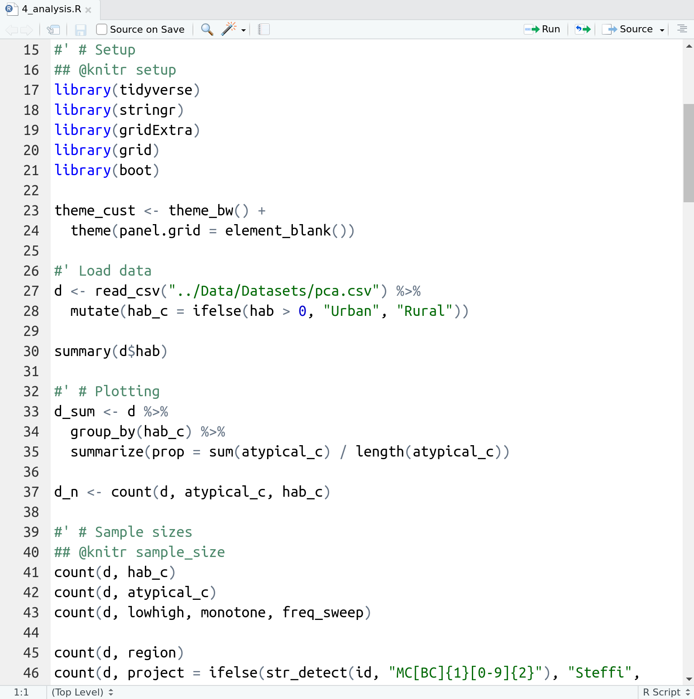

class: title-slide, nobar

## TWS R Workshop
# Creating Figures as an Intro to R
## Using the `ggplot2` package

.footer[Presentation available here: <>]

```{r setup, include = FALSE}
hide_answers <- TRUE

library(knitr)
opts_chunk$set(dpi = 250, fig.width = 6, fig.asp = 0.65, 
               out.width = "60%", cache = TRUE, fig.align = "center")

hook_output <- knit_hooks$get("output")
knit_hooks$set(output = function(x, options) {
  extra <- options$extra

  if(is.null(extra)) {
    return(hook_output(x, options))  # pass to default hook
  }
  x <- hook_output(x, options)
  if(any(extra == "compact")) x <- paste0("\n.compact[", x, "]")
  if(any(extra == "small")) x <- paste0("\n.small[", x, "]")
  if(any(extra == "compact_small")) x <- paste0("\n.compact[.small[", x, "]]")
  if(any(extra == "compact_extrasmall")) x <- paste0("\n.compact[.extra-small[", x, "]]")
  if(any(extra == "pause")) x <- paste0("--\n", x)
  x
})

library(tidyverse)
```


```{r, echo = FALSE}
ggplot(data = msleep, aes(x = vore, y = sleep_total, fill = vore)) +
  theme_bw() +
  geom_boxplot() +
  scale_fill_viridis_d() +
  geom_point()
```


---
class: space-list
background-image: url(`r "../AA_Common/steffi_office.jpg"`)
background-position: right 25px bottom 50px
background-size: 50%

# Introductions

## Dr. Steffi LaZerte

- Background in Biology (Animal Behaviour)
- Working with R since 2007
- Professional R programmer/consultant<br>since 2017

---
# What about you?

- Name
- Background (Area of study, etc.)
- Familiarity with Computer Programming (C+, Java, HTML, PHP, python, SAS)
- Familiarity with R
    - I've heard of R
    - I've installed R (before this class)
    - I've used R
    - I've used R a lot
    - I use R all the time


---
# Outline

## 1. A little about R

## 2. Creating figures with `ggplot2`
- Basic plot
- Common plot types
- Plotting by categories
- Adding statistics
- Customizing plots
- Annotating plots

## 3. Saving figures

## 4. (EXTRA) Combining figures 

---
background-image: url(`r "../AA_Common/impostR_en.png"`)
background-position: center center
background-size: 70%

# Impost**R** Syndrome

---
background-image: url(`r "../AA_Common/impostR_en.png"`)
background-position: right 75px top 25%
background-size: 30%

# Impost**R** Syndrome


--


---
class: nobar


.footer[[@allison_horst](https://github.com/allisonhorst/stats-illustrations)]


---
class: section

# Why R?

---
layout: true
# Why R?

---
background-image: url(`r "../AA_Common/Figures/R_hard.png"`)
background-position: right 15% bottom 10%
background-size: 70%

## R is hard

---
background-image: url(`r "../AA_Common/Figures/R_powerful2_edit.png"`)
background-position: center bottom 40%
background-size: 70%

## But R is powerful (and reproducible)!

---
background-image: url(`r "../AA_Common/Figures/spatial.png"`)
background-position: center bottom 10%
background-size: 40%

## R is also beautiful

---
background-image: url(`r "../AA_Common/Figures/R_free.png"`)
background-position: center bottom 40%
background-size: 70%

## R is affordable (i.e. free!)

---
layout: false
class: section

# What is R?

---
# R is Programming language

> A programming **language** is a way to give instructions in order to get a computer to do something

- You need to know the language (i.e. the code)
- Computers don't know what you mean, only what you type (unfortunately)
- Spelling, punctuation, and capitalization all matter!

## For example

**R, what is 56 times 5.8?**

```{r}
56 * 5.8
```

---
# Use code to tell R what to do

**R, what is the average of numbers 1, 2, 3, 4?**

```{r}
mean(c(1, 2, 3, 4))
```

--

**R, save this value for later**

```{r}
steffis_mean <- mean(c(1, 2, 3, 4))
```

--

**R, multiply this value by 6**

```{r}
steffis_mean * 6
```

---
# Code, Output, Scripts

.pull-left[
## Code
- The actual commands

## Output
- The result of running code or a script

## Script
- A text file full of code that you want to run
- You should **always** keep your code in a script
]


--

.pull-right[

## For example:

```{r}
mean(c(1, 2, 3, 4))
```
]





---
# RStudio vs. R


- **RStudio** is not **R**
- RStudio is a User Interface or IDE (integrated development environment)
    - (i.e., Makes coding simpler)

---
layout:false
class: section
# R Basics: Objects

Objects are *things* in the environment  

(Check out the **Environment** pane in RStudio)


---
# `functions()` - Do things, Return things

**`mean()`, `read_csv()`, `ggplot()`, `c()`, etc.**

--

- Always have `()`
- Can take **arguments** (think 'options')
    - `mean(x = c(2, 10, 45))`, 
    - `mean(x = c(NA, 10, 2, 65), na.rm = TRUE)`

--

- Arguments defined by **name** or by **position**
- With correct position, do not need to specify by name


.pull-left[
### By name:
```{r}
mean(x = c(1, 5, 10))
```
]

.pull-right[
### By position:
```{r}
mean(c(1, 5, 10))
```
]

---
# R documentation

.pull-left-15[
```{r}
?mean
```
]

--


--


---
# `Data`

Generally kept in `vectors` or `data.frames`

- These are objects with names (like functions)
- We can use `<-` to assign values to objects (assignment)

.pull-left-45[
## Vector (1 dimension)

```{r}
my_data <- c("a", 100, "c")
my_data
```
]

.pull-right-55[
## Data frame (2 dimensions)

```{r}
my_data <- data.frame(site = c("s1", "s2", "s3"),
                      count = c(101, 102, 103),
                      treatment = c("a", "b", "c"))
my_data
```
]


---
layout:false
class: section
# R Basics: Code


---
# Your first code

```{r, eval = FALSE}
# First load the package and data
library(tidyverse)
sleep <- read_csv("https://git.io/Je6DF")

# Now create the figure
ggplot(data = sleep, aes(x = sleep_total, y = sleep_rem)) +
    geom_point()
```

.spacer[ ]

- Copy/paste or type this into the script window in RStudio
- Click anywhere on the first line of code
- Use the 'Run' button to run this code, **or** use the short-cut `Ctrl-Enter`
    - Repeat until all the code has run

---
layout: true
# First Code

```{r, message = FALSE, fig.width = 5, fig.asp = 0.45, out.width = "60%", fig.align = "center"}
# First load the package and data
library(tidyverse)
sleep <- read_csv("https://git.io/Je6DF")

# Now create the figure
ggplot(data = sleep, aes(x = sleep_total, y = sleep_rem)) +
    geom_point()
```

---


---


---


---


---


---


---


---


---


---
layout: false
class: section

# Hooray!

## Time for Figures!

---
class: nobar
# `ggplot2`


.footer[[@allison_horst](https://github.com/allisonhorst/stats-illustrations)]


---
# A basic plot

```{r, fig.asp = 0.75, out.width = "50%"}
library(ggplot2) # Also inside the tidyverse
ggplot(data = sleep, aes(x = sleep_total, y = sleep_rem)) +
    geom_point()
```


---
# Break it down
```{r, eval = FALSE}
library(ggplot2) # Also inside the tidyverse
ggplot(data = sleep, aes(x = sleep_total, y = sleep_rem)) +
    geom_point()
```

### `ggplot(data = sleep, aes(x = sleep_total, y = sleep_rem))`


- Load the `ggplot2` (or `tidyverse`) package
- Set the attributes of your plot
- **`data`** = Dataset
- **`aes`** = Aesthetics (how the data are used)
- Think of this as your plot defaults

---

# Break it down
```{r, eval = FALSE}
library(ggplot2) # Also inside the tidyverse
ggplot(data = sleep, aes(x = sleep_total, y = sleep_rem)) +
    geom_point()
```

### `geom_point()`

- Choose a `geom` function to display the data
- Always *added* to a `ggplot()` call with **+**

> ggplots are essentially layered objects, starting with a call to `ggplot()`


---
# Plots are layered

.pull-left[
.small[
```{r, out.width = "100%"}
ggplot(data = sleep, aes(x = vore, y = sleep_total))
```
]]

.pull-right[
.small[
```{r, out.width = "100%"}
ggplot(data = sleep, aes(x = vore, y = sleep_total)) +
  geom_boxplot()
```
]]

---
# Plots are layered

.pull-left[
.small[
```{r, out.width = "100%"}
ggplot(data = sleep, aes(x = vore, y = sleep_total))
```
]]

.pull-right[
.small[
```{r, out.width = "100%"}
ggplot(data = sleep, aes(x = vore, y = sleep_total)) +
  geom_point()                                          #<<
```
]]

---
# Plots are layered

.pull-left[
.small[
```{r, out.width = "100%"}
ggplot(data = sleep, aes(x = vore, y = sleep_total))
```
]]

.pull-right[
.small[
```{r, out.width = "100%"}
ggplot(data = sleep, aes(x = vore, y = sleep_total)) +
  geom_boxplot()                                        #<<
```
]]

---
# Plots are layered

.pull-left[
.small[
```{r, out.width = "100%"}
ggplot(data = sleep, aes(x = vore, y = sleep_total))
```
]]

.pull-right[
.small[
```{r, out.width = "100%"}
ggplot(data = sleep, aes(x = vore, y = sleep_total)) +
  geom_violin()                                          #<<
```
]]

---
# Plots are objects


#### Any ggplot can be saved as an object

```{r}
g <- ggplot(data = sleep, aes(x = vore, y = sleep_total))
```

--

.pull-left[
```{r, out.width = "100%"}
g
```
]

--

.pull-right[
```{r, out.width = "100%"}
g + geom_boxplot()
```
]

---
# Layering

.pull-left[
### You can add multiple layers

```{r, out.width = "100%"}
g +
  geom_boxplot() +
  geom_point(size = 2, colour = "red")
```
]

--

.pull-right[
### Order matters

```{r, out.width = "100%"}
g +
  geom_point(size = 2, colour = "red") +
  geom_boxplot()
```
]

---
class: section

# More Geoms

### (Plot types)

---
# Geoms: Lines

```{r}
ggplot(data = sleep, aes(x = sleep_total, y = sleep_rem)) +
{{ geom_line()}}
```


---
# Geoms: Boxplots

```{r}
ggplot(data = sleep, aes(x = vore, y = sleep_total)) +
{{ geom_boxplot()}}
```


---
# Geoms: Histogram

```{r}
ggplot(data = sleep, aes(x = sleep_rem)) +
{{ geom_histogram(binwidth = 0.5)}}
```

--


---
# Geoms: Barplots

### Let `ggplot` count your data

```{r, fig.asp = 0.6}
ggplot(data = sleep, aes(x = conservation)) +
{{ geom_bar()}}
```

---
# Geoms: Barplots

### You can also provide the counts

.small[
```{r, fig.asp = 0.35, fig.width = 12, out.width = "100%"}
ggplot(data = sleep, aes(x = name, y = sleep_total)) +
  geom_bar(stat = "identity") +
  theme(axis.text.x = element_text(angle = 45, hjust =1))
```
]

---
# Your Turn: Create this plot

.small[
```{r, eval = FALSE}
library(ggplot2)

ggplot(data = ???, aes(x = ???, y = ???)) + #<<
  geom_???(???)                             #<<
```

```{r, echo = FALSE, fig.asp = 0.5}
ggplot(data = sleep, aes(x = vore, y = awake)) +
  geom_boxplot(colour = "blue")
```
]
---
exclude: `r hide_answers`
# Your Turn: Create this plot

.small[
```{r, fig.asp = 0.5}
library(ggplot2)

ggplot(data = sleep, aes(x = vore, y = awake)) + #<<
  geom_boxplot(colour = "blue") #<<
```
]


---
class: section
# Showing data by group


---
# Mapping aesthetics

```{r}
ggplot(data = sleep, aes(x = sleep_total, y = sleep_rem, colour = vore)) +
  geom_point()
```


---
# Mapping aesthetics

```{r, echo = FALSE, warning = FALSE, out.width = "100%", fig.asp = 0.48, fig.width = 12}
g <- ggplot(data = sleep, aes(x = sleep_total, y = sleep_rem)) +
  theme(legend.position = c(0, 1),
        legend.justification = c(-0.05, 1))

g1 <- g + geom_point(aes(colour = vore)) + labs(title = "colour = vore")
g2 <- g + geom_point(aes(size = bodywt)) + labs(title = "size = bodywt")
g3 <- g + geom_point(aes(alpha = body_size)) + labs(title = "alpha = body_size")
g4 <- g + geom_point(aes(shape = vore)) + labs(title = "shape = vore")

gridExtra::grid.arrange(g1, g2, g3, g4)

#g2 <- ggplot(data = sleep, aes(x = vore, y = sleep_total, fill = size)) +
#  geom_boxplot()
```


---
# Mapping aesthetics

### `ggplot` automatically populates the legends (combining where it can)

```{r, fig.asp = 0.55}
ggplot(data = sleep, aes(x = sleep_total, y = sleep_rem, 
                         colour = vore, shape = vore, size = bodywt)) +
  geom_point()
```

---
# Faceting: `facet_wrap()`

.small[
```{r, fig.asp = 0.43, out.width = "90%"}
ggplot(data = sleep, aes(x = sleep_total, y = sleep_rem, colour = vore)) +
  geom_point() +
  facet_wrap(~ body_size, nrow = 1)
```
]


---
# Faceting: `facet_grid()`

.small[
```{r,  fig.asp = 0.43, fig.width = 10, out.width = "80%"}
ggplot(data = sleep, aes(x = vore, y = sleep_total)) +
  theme(axis.text.x = element_text(angle = 45, hjust = 1)) +
  geom_boxplot() +
  facet_grid(body_size ~ conservation)
```
]


---
# Your Turn: Create this plot

```{r, eval = FALSE}
ggplot(data = ???, aes(???)) + #<<
  ??? +                        #<<
  ???                          #<<
```

```{r, echo = FALSE, fig.asp = 0.3, fig.width = 8, out.width = "85%"}
ggplot(data = sleep, aes(x = body_size, y = awake, fill = body_size)) + 
  geom_boxplot() +                                                      
  facet_wrap(~ vore, nrow = 1)                                          
```


> **Hint:** `colour` is for outlining with a colour, `fill` is for 'filling' with a colour


---
exclude: `r hide_answers`
# Your Turn: Create this plot

```{r, fig.asp = 0.3, fig.width = 8, out.width = "85%"}
ggplot(data = sleep, aes(x = body_size, y = awake, fill = body_size)) + #<<
  geom_boxplot() +                                                      #<<
  facet_wrap(~ vore, nrow = 1)                                          #<<
```


> **Hint:** `colour` is for outlining with a colour, `fill` is for 'filling' with a colour

---
class: section

# Adding Statistics to Plots

---
# Using stats: Summarizing data

### Add data means as points
.small[
```{r, fig.asp = 0.6}
ggplot(data = sleep, aes(x = vore, y = sleep_total)) +
  stat_summary(geom = "point", fun.y = mean)
```
]

---
# Using stats: Summarizing data

### Add error bars, calculated from the data
.small[
```{r, fig.asp = 0.57}
ggplot(data = sleep, aes(x = vore, y = sleep_total)) +
  stat_summary(geom = "point", fun.y = mean) +
  stat_summary(geom = "errorbar", width = 0.15, fun.data = mean_se)
```
]

---
# Using stats: Trendlines

### `geom_line()` is connect-the-dots, not a trend or linear model

```{r, fig.asp = 0.55}
ggplot(data = sleep, aes(x = sleep_total, y = sleep_rem)) +
  geom_point() +
  geom_line()
```

--


---
# Using stats: Trendlines
### Let's add a trend line properly

Start with basic plot:
.small[
```{r, fig.asp = 0.55}
ggplot(data = sleep, aes(x = sleep_total, y = sleep_rem)) +
  geom_point()
```
]

---
# Using stats: Trendlines

.pull-left[
### Add the `stat_smooth()`
- `lm` is for "linear model" (i.e. trendline)
- the grey area represents the standard error
]

.pull-right[
.small[
```{r, fig.asp = 0.75, out.width = "100%"}
ggplot(data = sleep, 
       aes(x = sleep_total, y = sleep_rem)) +
  geom_point() + 
{{ stat_smooth(method = "lm")}}
```
]
]

---
# Using stats: Trendlines

.pull-left[
### Add the `stat_smooth()`
- `lm` is for "linear model" (i.e. trendline)
- the grey area represents the standard error
- remove the grey area with `se = FALSE`
]

.pull-right[
.small[
```{r, fig.asp = 0.75, out.width = "100%"}
ggplot(data = sleep, 
       aes(x = sleep_total, y = sleep_rem)) +
  geom_point() + 
{{ stat_smooth(method = "lm", se = FALSE)}}
```
]]


---
# Using stats: Trendlines

### A line for each group

```{r, fig.asp = 0.55}
ggplot(data = sleep, aes(x = sleep_total, y = sleep_rem, colour = vore)) +
  geom_point() + 
  stat_smooth(method = "lm", se = FALSE)
```

---
# Using stats: Trendlines

### A line for each group AND overall
.small[
```{r, fig.asp = 0.55}
ggplot(data = sleep, aes(x = sleep_total, y = sleep_rem, colour = vore)) +
  geom_point() +  
  stat_smooth(method = "lm", se = FALSE) + 
  stat_smooth(method = "lm", se = FALSE, colour = "black")
```
]

---
# Your Turn: Create this plot

```{r, eval = FALSE}
ggplot(data = ???, aes(x = ???, y = ???, ??? = ???)) + #<<
  ??? +                                                #<<
  ??? +                                                #<<
  ???                                                  #<<
```


```{r, echo = FALSE, fig.asp = 0.4, fig.width = 10, out.width = "80%"}
ggplot(data = sleep, aes(x = sleep_total, y = sleep_rem, colour = body_size)) +
  facet_wrap(~ body_size) +
  geom_point() +
  stat_smooth(method = "lm")
```

---
exclude: `r hide_answers`
# Your Turn: Create this plot

```{r, fig.asp = 0.4, fig.width = 10, out.width = "80%"}
ggplot(data = sleep, aes(x = sleep_total, y = sleep_rem, colour = body_size)) + #<<
  facet_wrap(~ body_size) +                                                     #<<
  geom_point() +                                                                #<<
  stat_smooth(method = "lm")                                                    #<<
```


---
class: section

# Customizing plots

---
# Customizing: Starting plot

### Let's work with this plot

```{r}
g <- ggplot(data = sleep, aes(x = sleep_total, y = sleep_rem, colour = vore)) +
  geom_point()
```

```{r, echo = FALSE, fig.asp = 0.6}
g
```

---
# Customizing: Labels

.small[
```{r, fig.asp = 0.6}
g + labs(title = "Total REM vs. overall sleep", 
         x = "Total sleep (hrs)", 
         y = "Total REM sleep (hrs)",
         colour = "Diet", tag = "A")
```
]

--


---
# Customizing: Built-in themes

.pull-left[
```{r, echo = FALSE, fig.show = "hold", out.width = "95%", fig.width = 5, fig.asp = 0.5}
g + theme_bw() + labs(title = "g + theme_bw()")
g + theme_classic() + labs(title = "g + theme_classic()")
```
]

.pull-right[
```{r, echo = FALSE, fig.show = "hold", out.width = "95%", fig.width = 5, fig.asp = 0.5}
g + theme_minimal() + labs(title = "g + theme_minimal()")
g + theme_dark() + labs(title = "g + theme_dark()")
```
]


---
# Customizing: Data range

.pull-left[
### Limit the data (exclude data)
```{r fig.width = 5, out.width = "100%", warning = FALSE}
g + xlim(c(0, 15))
```

```{r, echo = FALSE, fig.keep = "none"}
# Print the warning below the plot
g + xlim(c(0, 15))
```
]

--

.pull-right[
### Limit the view (zoom)

```{r, fig.width = 5, out.width = "100%"}
g + coord_cartesian(xlim = c(0, 15))
```
]

---
# Customizing: Axes

`scale_` + (`x` or `y`) + type (`contiuous`, `discrete`, `date`, `datetime`)

- `scale_x_continuous()`
- `scale_y_discrete()`
- etc.

### Common arguments

```{r, eval = FALSE}
g + scale_x_continuous(breaks = seq(0, 20, 10)) # Tick breaks
g + scale_x_continuous(limits = c(0, 15))       # xlim() is a shortcut for this
g + scale_x_continuous(expand = c(0, 0))        # Space between axis and data
```

---
# Customizing: Axes

```{r, echo = FALSE, fig.asp = 0.6, out.width = "80%", fig.width = 10, warning = FALSE}
temp <- g + theme(legend.position = "none")
g1 <- temp + scale_x_continuous(breaks = seq(0, 20, 2)) + 
  labs(title = "g + scale_x_continuous(breaks = seq(0, 20, 10))")
g2 <- temp + scale_x_continuous(limits = c(0, 15)) + 
  labs(title ="g + scale_x_continuous(limits = c(0, 15))")  ## xlim() is a shortcut for this
g3 <- temp + scale_x_continuous(expand = c(0, 0)) + 
  labs(title = "g + scale_x_continuous(expand = c(0, 0))")
gridExtra::grid.arrange(g1, g2, g3, nrow = 2)
```


---
# Customizing: Aesthetics

### Using scales

`scale_` + aesthetic (`colour`, `fill`, `size`, etc.) + type (`manual`, `continuous`, `datetime`, etc.)

```{r, fig.asp = 0.55}
g + scale_colour_manual(name = "Type", 
                        values = c("blue", "red", "green", "yellow", "black"))
```

---
# Customizing: Aesthetics

### Using scales

Or be very explicit:

```{r, fig.asp = 0.5}
g + scale_colour_manual(name = "Type", 
                        values = c("carni" = "blue", "herbi" = "red", "insecti" = "green",
                                   "omni" = "yellow", "unknown" = "black"))
```

---
# Customizing: Aesthetics

### For colours, consider colour-blind-friendly scales

```{r, eval = FALSE}
library(ggthemes)
g + scale_colour_colorblind(name = "Type")
g + scale_colour_viridis_d(name = "Type")
```

```{r, echo = FALSE, fig.asp = 0.3, out.width = "100%", fig.width = 10}
gridExtra::grid.arrange(g + ggthemes::scale_colour_colorblind(name = "Type"),
             g + scale_colour_viridis_d(name = "Type"), nrow = 1)
```


---
# Customizing: Aesthetics

### Forcing

Remove the association between a variable and an aesthetic

```{r, fig.width = 6, fig.asp = 0.5, out.width = "50%"}
ggplot(data = sleep, aes(x = sleep_total, y = sleep_rem, colour = vore)) +
  geom_point(colour = "green", size = 5) +
  stat_smooth(method = "lm", se = FALSE, colour = "red")
```


---
# Customizing: Legends placement

.pull-left[
### At the: top, bottom, left, right
```{r, fig.asp = 0.8, fig.width = 5, out.width = "100%"}
g + theme(legend.position = "top")
```
]

.pull-right[
### Exactly here
```{r, fig.asp = 0.8, fig.width = 5, out.width = "100%"}
g + theme(legend.position = c(0.15, 0.7))
```
]

---
# Your Turn: Create this plot

```{r, fig.asp = 0.6, out.width = "80%", echo = FALSE, warning = FALSE}
ggplot(sleep, aes(x = sleep_cycle, y = awake, colour = body_size)) +
  theme_classic() + 
  geom_point(size = 5) +
  stat_smooth(method = "lm", se = FALSE, colour = "black") + 
  scale_colour_manual(name = "Size", values = c("grey", "darkblue")) +
  labs(x = "Sleep cycle length (hrs)",
       y = "Awake time (hrs)")
```

---
exclude: `r hide_answers`
# Your Turn: Create this plot

.small[
```{r, fig.asp = 0.5, out.width = "55%", warning = FALSE}
ggplot(sleep, aes(x = sleep_cycle, y = awake, colour = body_size)) +
  theme_classic() + 
  geom_point(size = 5) +
  stat_smooth(method = "lm", se = FALSE, colour = "black") + 
  scale_colour_manual(name = "Size", values = c("grey", "darkblue")) +
  labs(x = "Sleep cycle length (hrs)",
       y = "Awake time (hrs)")
```
]


---
class: section

# Annotating plots

---
# Annotating

### Plot to be annotated: Let's add sample sizes

```{r, fig.asp = 0.25, out.width = "100%", fig.width = 10}
ggplot(data = sleep, aes(x = sleep_total, y = sleep_rem, colour = vore)) +
  geom_point() +
  facet_grid(~ vore)
```

---
# Annotating

### Create data to use in our annotations

```{r}
n <- data.frame(vore = c("carni", "herbi", "insecti", "omni", "unknown"),
                text = c("n = 10", "n = 24", "n = 4", "n = 18", "n = 5"))
n
```

---
# Annotating

.small[
```{r, fig.asp = 0.25, out.width = "100%", fig.width = 10}
ggplot(data = sleep, aes(x = sleep_total, y = sleep_rem, colour = vore)) +
  geom_point() +
  facet_grid(~ vore) +
  geom_text(data = n,                  # Use 'n' data (not the `sleep` data)       #<<
            x = -Inf, y = +Inf,        # Hard coded location (left, top)           #<<
            aes(label = text),         # Map 'text' to label                       #<<
            hjust = 0, vjust = 1)      # Adjust horizontal and vertical placement  #<<
```
]

--

> ggplot will automatically apply aesthetics in the `ggplot()` line to all data included

---
class: section
# Saving plots

---
# Saving plots

## RStudio Export
**Demo**

--

## `ggsave()`

```{r}
g <- ggplot(sleep, aes(x = vore, y = sleep_total)) +
  geom_boxplot()

ggsave(filename = "sleep_boxplot.png", plot = g)
```

---
# Saving plots

## Publication quality plots

- Many publications require 'lossless' (pdf, svg, eps, ps) or high quality formats (tiff, png)
- Specific sizes corresponding to columns widths
- Minimum resolutions


```{r, cache = FALSE}
g <- ggplot(sleep, aes(x = vore, y = sleep_total)) +
  geom_boxplot() +
  labs(x = "Carnivore", y = "Total sleep (hrs)") + 
  theme(axis.text.x = element_text(angle = 45, hjust = 1))

ggsave(filename = "sleep_boxplot_sm.pdf", plot = g, dpi = 300,
       height = 80, width = 129, units = "mm")
```

---
class: section

# Wrapping Up!


---
# Wrapping up: Common mistakes

- The **package** is `ggplot`**2**, the function is just **`ggplot()`**
- Did you remember to put the **`+`** at the **end** of the line?
- Order matters! If you're using custom `theme()`'s, make sure you put these lines **after** bundled themes like `theme_bw()`, or they will be overwritten

---
# Wrapping up: Common mistakes

### I get an error regarding a missing aesthetic? But I know it's there!


You are probably trying to plot two different datasets, and you make references to variables in the `ggplot()` call that don't exist in one of the datasets:


> Here, `conservation` only exists in the `sleep` dataset, not in the `n` dataset

```{r, error = TRUE}
n <- dplyr::count(sleep, vore)

ggplot(sleep, aes(x = sleep_total, y = sleep_rem, colour = conservation)) + #<<
  geom_point() +
  facet_grid(~ vore) +
  geom_text(data = n, aes(label = n), 
            x = -Inf, y = +Inf, hjust = 0, vjust = 1)
```

---
# Wrapping up: Common mistakes

### I get an error regarding a missing aesthetic? But I know it's there!

Either move the aesthetic...

```{r, eval = FALSE}
ggplot(sleep, aes(x = sleep_total, y = sleep_rem)) +
  geom_point(aes(colour = conservation)) +                #<<
  facet_grid(~ vore) +
  geom_text(data = n, aes(label = n), 
            x = -Inf, y = +Inf, hjust = 0, vjust = 1)
```

Or assign it to NULL where it is missing...

```{r, eval = FALSE}
ggplot(sleep, aes(x = sleep_total, y = sleep_rem, colour = conservation)) +
  geom_point() +
  facet_grid(~ vore) +
  geom_text(data = n, aes(label = n, colour = NULL),      #<<
            x = -Inf, y = +Inf, hjust = 0, vjust = 1)
```

---
# Wrapping up

[Answers!](https://github.com/steffilazerte/Teaching/raw/master/TWS%202019%20-%20Figures%20in%20R/intro_with_figures_answers.pdf)

## R is hard: But have no fear!
- Don't expect to remember everything!
- Copy/Paste is your friend (never apologize for using it!)
- Consider this workshop a resource to return to

## Further reading
- RStudio > Help > Cheatsheets > Data Visualization with ggplot2
- [R for Data Science: Chapter 3](http://r4ds.had.co.nz/data-visualisation.html)
- [Cookbook for R](http://www.cookbook-r.com) - by Winston Chang
  - See also R Graphics Cookbook by Winston Chang
- [ggplot2 book v2 Hadley Wickham](https://github.com/hadley/ggplot2-book)
  - You can compile it yourself from GitHub, or ask me for my compiled version (pdf)
- [gridExtra Vignette:  Arranging Multiple Grobs](https://cran.r-project.org/web/packages/gridExtra/vignettes/arrangeGrob.html)


---
class: section
# EXTRA: Combining multiple plots

---
# Combining with `gridExtra`

.small[
```{r, out.width = "75%", fig.asp = 0.38,  fig.width = 8, message = FALSE}
library(gridExtra)

g1 <- ggplot(sleep, aes(x = sleep_total, y = sleep_rem, colour = vore)) +
  geom_point()

g2 <- ggplot(sleep, aes(x = vore, y = sleep_total, fill = vore)) +
  geom_boxplot()

grid.arrange(g1, g2, nrow = 1)
```
]

---
# Combining multiple plots


```{r}
library(gridExtra)
g1 <- ggplot(sleep, aes(x = body_size, y = sleep_total)) +
  geom_boxplot()

g2 <- ggplot(sleep, aes(x = sleep_total, y = sleep_rem, colour = vore)) +
  geom_point()

g3 <- ggplot(sleep, aes(x = vore, y = sleep_total, fill = vore)) +
  geom_bar(stat = "identity")

layout <- rbind(c(1,2),
                c(3,3))
```


```{r, echo = FALSE, fig.width = 1, fig.asp = 1, out.width = "15%"}
library(gridExtra)
library(grid)
gs <- lapply(1:3, function(ii) 
  grobTree(rectGrob(gp=gpar(fill=ii, alpha=0.5)), textGrob(ii)))
lay <- rbind(c(1,2),
             c(3,3))
grid.arrange(grobs = gs, layout_matrix = lay)

```

---
# Combining multiple plots

```{r, warning = FALSE, out.width = "65%", fig.asp = 0.63, fig.width = 10}
grid.arrange(g1, g2, g3, layout_matrix = layout)
```

---
# Your turn

### Combine any 3 figures

- feel free to try out the layout matrix option if you wish

```{r, eval = FALSE}
library(gridExtra) # you'll probably have to install this first!

g1 <- ???
g2 <- ???
g3 <- ???

grid.arrange(???)
```

