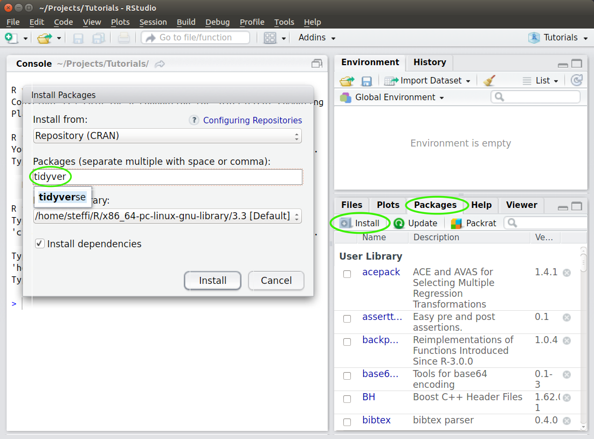

Welcome! I'm excited for the opportunity to share my love of R with you. This document should give you all the details you need to get you ready!

# Workshop Details

**Date**: Friday November 22 2019  
**Time**: 6:00pm - 8:30pm     
**Location**: 115 Machray Hall, University of Manitoba  

**Instructor**: Stefanie LaZerte (sel@steffilazerte.ca)

We are going to be covering a lot in our R session, so to give us a jump start, I've compiled some things you should have done before coming:

- Install R (or update R)
- Install RStudio (or update RStudio)
- Install `tidyverse` packages (or update `tidyverse` packages)

> **IMPORTANT!**:  
> If you have any problems installing the software or packages, please contact me (sel@steffilazerte.ca) so we can sort out any problems before the workshop,


------------------------

# Instructions

## 1. Install R (Update R)

> Even if you already have R installed, **please update it**, so we're all working with the same version

Depending on your operating system, you can install R in one of the following ways:

__Windows__

- Go to the Windows download page: <https://cran.r-project.org/bin/windows/base/>
- Download and install R for windows (the link at the top)

__Mac__  

- Go to the Mac OS X download page: <https://cran.r-project.org/bin/macosx/>
- Download and install the version that matches your Mac OS X

__Linux: Debian/Ubuntu__

- Specific details: <https://cran.r-project.org/bin/linux/ubuntu/README.html>
- Add one of the CRAN repositories to you apt (otherwise your R will be out of date)
    - See the above link if you're not using Ubuntu 18.04, Bionic Beaver

```
sudo add-apt-repository "deb https://cloud.r-project.org/bin/linux/ubuntu bionic-cran35/"
sudo apt-key adv --keyserver keyserver.ubuntu.com --recv-keys E298A3A825C0D65DFD57CBB651716619E084DAB9
```

- Install R from this repository:

```
sudo apt update
sudo apt install r-base r-base-dev
```

## 2. Install RStudio

> Even if you already have RStudio installed, **please update it**, so we're all working with the same version

- For all Operating systems (i.e., Windows, Mac Os, Linux, etc.) go to RStudio's download page:  <https://www.rstudio.com/products/rstudio/download/#download>
- Download and install the __installer__ that matches your system (i.e. select your link from the top options, not the Zip/Tarball options)

Open RStudio  **not R** . RStudio automatically opens R for you in the 'Console' pane

**Verify that your version of R by looking at the first line of the console, you should see something like this:**

```
R version 3.6.1 (2019-07-05) -- "Action of the Toes"
Copyright (C) 2019 The R Foundation for Statistical Computing
Platform: x86_64-pc-linux-gnu (64-bit)

R is free software and comes with ABSOLUTELY NO WARRANTY.
You are welcome to redistribute it under certain conditions.
Type 'license()' or 'licence()' for distribution details.

  Natural language support but running in an English locale

R is a collaborative project with many contributors.
Type 'contributors()' for more information and
'citation()' on how to cite R or R packages in publications.

Type 'demo()' for some demos, 'help()' for on-line help, or
'help.start()' for an HTML browser interface to help.
Type 'q()' to quit R.
```

The important line is the first one: `R version 3.6.1 (2019-07-05) -- "Action of the Toes"`

## 3a) Install `tidyverse` package

Packages are extensions or add-ons for R. You will use many different ones over the course of your work with R. `tidyverse` is name of a collection of newer packages for data management and creating visuals.

In RStudio:

- Click on the 'Packages' tab in the lower right hand corner
- Click on the 'Install' button right below the tab
- Type 'tidyverse' into the 'Packages' box, and click on 'Install'



- This may take a little while (you will see lots of download text in red in your console)
- When it's finished, you should see a message similar this one to in the console (lower left hand pane)

```
* DONE (tidyverse)

The downloaded source packages are in
	‘/tmp/RtmpACWq9S/downloaded_packages’
> 
```

- Test that your installation had no problems by typing `library(tidyverse)` into the console and hitting enter. You should see something like this:

```{r}
library(tidyverse)
```

## 3b) Update `tidyverse`

**This is only necessary if you have an older version of `tidyverse` installed.**

In RStudio:    

- Click on on the 'Update' button next to the 'Install' button
- Click on 'Select All' button
- Click on 'Install Updates' button
- **Repeat** until there are no new updates

__Congratulations! Now you're ready to get into the fun stuff :)__
